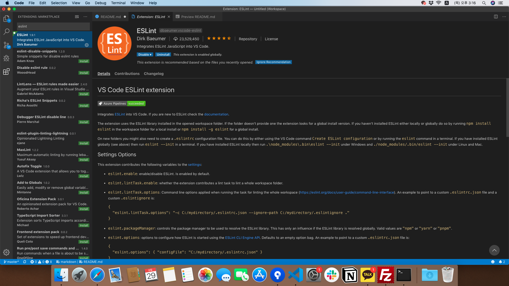
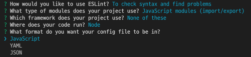

# OT 준비자료

# Node JS 설치 방법

아래 링크에 접속한 이후에 LTS버전을 설치하면 됩니다.

https://nodejs.org/en/

설치 이후 ```node -v``` 와 ```npm -v```가 실행된다면 정상적으로 설치 된 것입니다.


# VisualStudio Code 설치 방법


아래 링크에 접속한 이후에 OS에 맞게 설치하면 됩니다.

https://code.visualstudio.com

> Code Editor로는 Visual Studio Code, Atom, Sublime Text등 다양한 툴이 있으며 자신에게 맞는 환경을 사용하면 됩니다.

[vscode shortcuts 보기](https://code.visualstudio.com/shortcuts/keyboard-shortcuts-windows.pdf)

## Extension 설치

Visual Studio Code를 설치하였다면 다양한 확장 프로그램이 존재합니다.

그중에서 몇가지를 소개하려고 합니다.

> # Beautify

## 설치 방법
Extension에서 검색을 하면 아래의 화면이 나오게 됩니다.


여기서 install을 클릭해서 다운로드 해주시면 됩니다.

## 사용방법

1. 해당 파일로 이동합니다.
2. Show Command Palette(window: ctrl + shift + p, mac: command + shift + p)를 입력한 후에 
beautify를 검색하면 ```beautify file```과 ```beautify selection``` 가 나타납니다.


이때 두 가지 중에서 하나를 선택하면 됩니다.

beautify 적용 전


beautify 적용 후


## Format Selection 지정
또다른 방법으로 Beautify를 Format Selection으로 지정하는 방법이 있습니다.
이를 사용하게 된다면 ctrl+ K, F (mac: command + K, F)만으로 정렬을 할 수 있습니다.

1. Show Command Palette를 이용해서 ```Preferences: Open Settings (JSON)```를 검색합니다.


2. 아래 내용을 추가합니다.


```
"[javascript]": {
    "editor.defaultFormatter": "HookyQR.beautify"
}
```

3. 이제 ctrl + K,F (command + K, F)만을 이용해서 코드 자동정렬을 할 수 있습니다.

> Preferences: Open Settings (JSON) ?

Visual Studio Setting을 지정하는 방법 중 한가지입니다.
window를 이용하여 설정을 바꾸는 방법이 아닌, JSON 파일을 이용해서 설정값을 바꾸는 방법입니다.

> Open Default Setting (JSON) ?

검색을 하면서 Open Default Setting (JSON)이라는 것을 찾은 사람도 있을 겁니다.
이는 다양한 Setting 설정값을 가지고 있는 파일입니다. 따라서 파일을 열어보면
많은 정보가 있는 것을 확인 할 수 있습니다.
하지만 여기서 설정값을 잘못 바꾸게 되면 다시 원래대로 복귀 시키는 것에 어려움이 발생 할 수 있습니다.
또한 Open Settings와 Open Default Settings에서 우선순위는 Open Settings이 더 높습니다.
따라서 Default를 변경하는 것 보다 **Open Setting를 변경하는 것을 권장**합니다.

> # Bracket Pair Colorizer

코드를 작성하다 보면 괄호를 많이 사용하게 됩니다.
하지만 사용이 많아지면 어떤 괄호가 서로 짝을 이루는지 찾기 어렵습니다.
이러한 어려움을 해결해주는 것이 ```Bracket Pair Colorizer```입니다.
```Bracket Pair Colorizer```는 괄호에 색을 부여해서 괄호를 가시적으로 볼 수 있게 도와줍니다.

## 설치 방법


설치만 하게 되면 아래와 같이 괄호에 색이 추가되는 것을 환인 할 수 있다.


> # Code Spell Checker
코드를 작성하면서 오타가 많이 발생 할 수 있는데 이를 찾는 것은 어렵습니다.
심지어 Javascript같은 동적 언어에서는 실행시점에서 에러가 발생하기 때문에
오타로 인해 발생할 수 있는 문제점은 더욱 커지게 됩니다.
이러한 피해를 최소하 하도록 도와주는 Extensions이 ```Code Spell Checker```입니다.
```Code Spell Checker```는 오타가 있는(uncommon) 단어를 찾아주고, camelCase로 작성된 코드의 맞춤법을 검사 해준다.

## 설치 방법


> # indent-rainbow

소스코드 내에 tab에 색상을 부여해서 가시성을 높여준다.

## 설치 방법


> # Material Icon Theme

탐색기에서 폴더 아이콘을 통해서 가시성을 높여준다.

## 설치 방법


설치후 아래와 같이 폴더가 변한다.


> # [심화] ESLint

[ESLint 넘어가기](#eslint-end)


ESLint는 코드를 작성할 때 문제가 발생할 수 있는 에러와 코딩 스타일을 체크해주는 Extension입니다.

```ESLint```은 독립적으로 동작하는 Extension이 아니며 npm을 통해서 eslint를 설치 해주어야 합니다.
1.  ESLint Extension 설치



2.  npm을 이용해서 eslint 설치
```npm install -g eslint```


## 사용 방법

ESLint가 동작하기 위해서는 .eslintrc.js라는 설정파일이 만들어져야 합니다. 

1. package.json이 있는 Path로 이동합니다.

2. Show Command Palette에서 ```ESLint: Create ESLint configuration```을 찾는다.  (또는 TERMINAL에 ```eslint --init```를 입력한다.)


3. 설정을 지정하는 단계가 나타나고 이를 선택해줍니다.


※ 위 단계에서 space를 누른 선택/해제 할 수 있습니다.




위 단계를 진행하면 .eslintrc.js파일이 만들어 집니다.
.eslintrc.js 파일은 각종 설정 값들이 들어 있다.

eslint [PATH] 명령어를 입력하면
해당 경로에 코드를 검사해준다.


ESLint를 사용하는 것은 매우 번거로울 수 있지만
만약 자신이 제대로 성장하고 싶다면 사용하는 것을 추천합니다.
ESLint를 사용하면 에러를 사전예방할 수 있는 목적도 크지만 좋은 코딩스타일에 대해서 배우고 적용할 수 있는 기회가 될 수 있습니다.

[ESLint Rule 더보기](#https://eslint.org/docs/rules/)

## airbnb-base 

> ESLint 중 에서 airbnb에서 만든 코딩스타일을 가장  많이 사용한다고 합니다.
> 하지만 위 예제에서는 기본 ESLint 설치에 대해서만 다루고 있습니다.
> eslint-config-airbnb-base를 설정하고 싶다면 아래 추가 링크를 통해서 실습하는걸 추천드립니다.
> 1. airbnb-base관련 npm 설치
> 2. eslintrc.js 수정
>
> [ESLint에 대해서 더 알아보기](https://zerocho.com/category/JavaScript/post/583231719a87ec001834a0f2)

###### ESLint end

## font 설정

```Preferences: Open Settings(JSON)```(Command Palette에서 검색) 에 들어가서 아래와 같이 추가할 수 있습니다.
```
{
    ...
    "editor.fontFamily": "'D2Coding ligature'",
    "editor.fontSize":24, 
    "editor.fontLigatures": true,
    ...
}
```
editor.fontFamily는 글씨체, editor.fontSize는 글씨 크기, editor.fontLigatures는 연산자 묶음 등 다양항 값을 설정할 수 있다.

여기서는 D2Coding 글씨체로 설정하였는데 이는
인터넷을 통해서 다운받아야 합니다. 

[개발자 인기 폰트 보기](#https://futurecreator.github.io/2018/11/12/my-best-programming-font-top-3/)

[D2Coding 글씨체 다운받기](#https://github.com/naver/d2codingfont)

> ※ 자세한 정보는 구글링을 통해서 얻을 수 있습니다.
(또는 Default Setting을 통해서 유추 할 수 있습니.)

## 테마 설정

폰트와 마찬가지로  ```Preferences: Open Settings(JSON)```(Command Palette에서 검색) 에 들어가서 아래와 같이 추가할 수 있습니다.
```
    "workbench.iconTheme": "material-icon-theme",
```
Theme에 경우 Extension에서 다양하게 설치할 수 있으며 이를 적용하면 됩니다.


