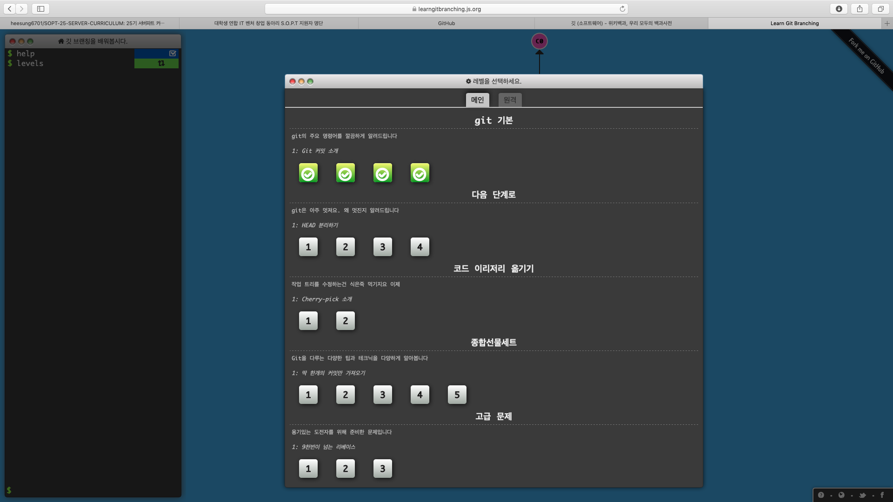
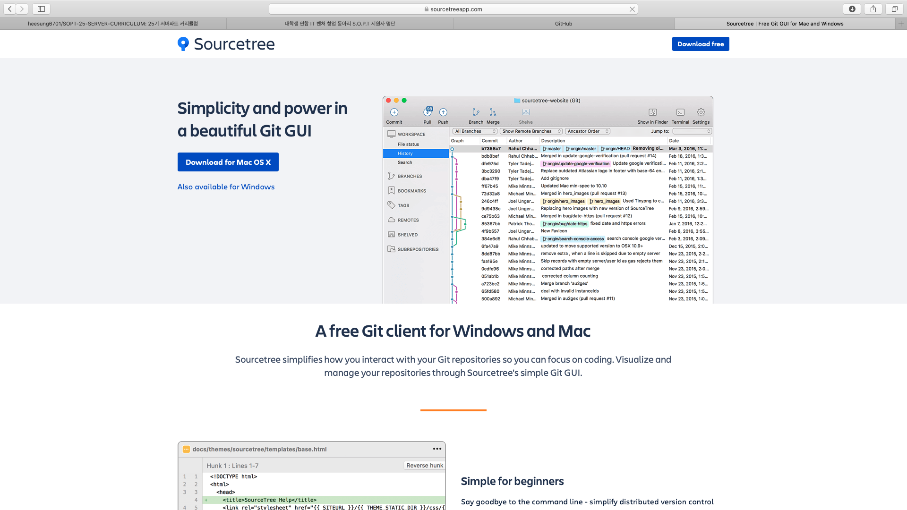

# 1차 세미나 준비 자료

# index
1. [git](#git-이란)
2. [SourceTree 설치](#sourcetree-설치)
3. [Module 설치](#module-설치)
4. [Javascript 학습](#javascript-학습)

# Git 이란

## Git 이란

> Git은 컴퓨터 파일의 변경사항을 추적하고 여러 명의 사용자들 간에 해당 파일들의 작업을 조율하기 위한 분산 버전 관리 시스템이다. ...  [위키백과](https://ko.wikipedia.org/wiki/깃_(소프트웨어))

Git은 소스코드를 관리하기 위해서 가장 많이 사용하는 시스템입니다. 실제 현업에서 Git은 필수라고 할 정도로 많은 곳에서 사용중입니다.

따라서 25기 WITH SOPT SERVER파트에서는 Git을 최대한 활용하는 방향으로 진행할 예정입니다.

1. 세미나 실습 코드

세미나 실습 코드는 매주 새로운 Repository를 생성할 계횝입니다. 이를 fork해서 실습 하도록 합니다.

2. 과제 제출

세미나에서 주어진 과제는 GitHub을 통해서 받을 예정입니다. 

3. [공유 문서 프로젝트](https://github.com/WITH-SOPT-SERVER/SHARED-LEARNING)

## Git 설치

[window 설치](#https://git-scm.com/download/win)

mac 설치: Terminal에 git만 입력해도 Git이 설치가 된다.

## Git 학습하기

[git 개념 실습 하기](https://learngitbranching.js.org/?locale=ko)

위 링크에서 아래 4개만 실습 해보세요!

(언제다 더 합습하는 것은 말리지 않습니다.)

# SourceTree 설치

## SourceTree 란?
Git을 쉽게 사용하기 위해서

## 설치 방법

※ git bash를 이용하실 분들은 SourceTree 설치를 생략하셔도 됩니다.

https://www.sourcetreeapp.com

***SourceTree를 사용하기 위해서는 Bitbucket계정이 필요합니다.***

[설치 방법](https://gocoder.tistory.com/737)

# Module 설치

## Express

## Http

# Javascript 학습

[공유 문서 프로젝트](https://github.com/WITH-SOPT-SERVER/SHARED-LEARNING/blob/master/Javascript.md)