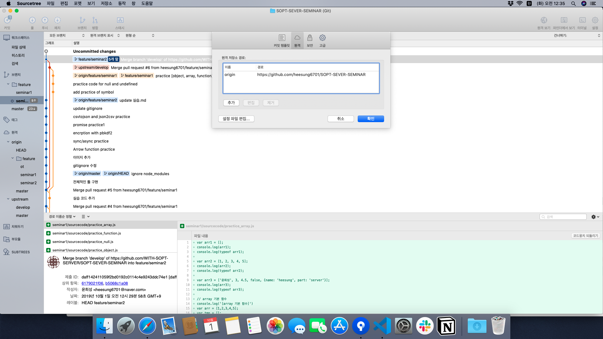
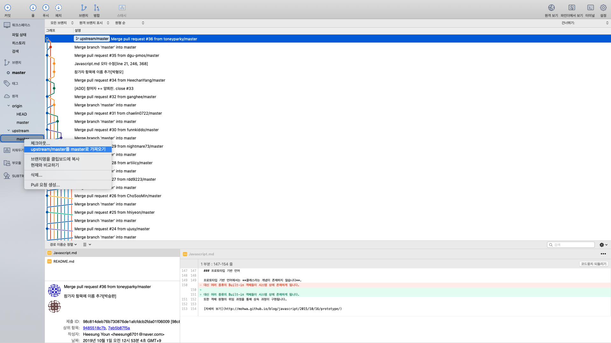

# GitHub 실습 (for 공유 문서 프로젝트)

지난 1차 세미나에서는 문서를 수정해서 Pull Request를 하는 실습을 진행했습니다.

[SHARED-LEARNING](https://github.com/WITH-SOPT-SERVER/SHARED-LEARNING) 페이지에 가보면
참가자 목록의 이름이 추가된 것을 확인 할 수 있습니다.

하지만 개인 Repository에 들어가보면 위 링크가 아닌 이전 버전인 것을 확인할 수 있습니다.
이러한 이유는 개개인의 작업(Pull Request)를 통해서 합쳐진 공간은 WITH-SOPT-SERVER/SHARED-LEARNING 페이지이기 때문에
개인 Repository(개인git아이디/SHARED-LEARNING)에서는 적용이 안되었습니다.

Local(컴퓨터)에서 개인 Repository에서만 pull을 받았다면 이제는 공동 작업 Repository에 적용된 내용을 가져오는 실습을 진행하겠습니다.

1. 먼저 sourcetree를 켜줍니다.

2. 우측 상단에 설정을 클릭하고 원격(또는 Remote) 탭을 클릭합니다.

3. 추가버튼을 눌러줍니다.

> 이때 기존에 있던 원격저장소의 이름을 origin으로 바꿔주면 이후에 편리합니다. 개인 저장소는 origin, 공용 저장소는 upstream으로 구분하면 편리합니다.

4. 원격 저장소의이름은 `upstream`, URL 주소는 공용 저장소의 주소(https://github.com/WITH-SOPT-SERVER/SHARED-LEARNING)으로 지정합니다.

5. 확인을 눌러주면 왼쪽 아래에 원격 아래의 upstream이 생긴것을 확인할 수 있습니다.

> 만약 upstream 아래에 아무것도 없다면 (우클릭)->(upstream 에서 가져오기) 를 클릭하면 최신 버전의 원격 저장소 정보를 확인할 수 있습니다.

master를 우 클릭을 하면 `upstream/master를  master로 가져오기`를 클릭해주면 공용 저장소에서 Local 저장소로 변경사항이 적용되게 됩니다.

6. 이제 local 저장소에서 공용 저장소에 적용된 내용이 업데이트 된 것을 확인할 수 있습니다.

