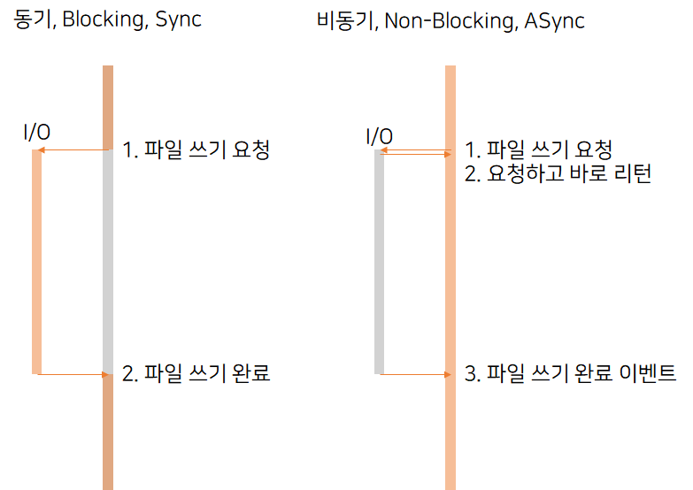
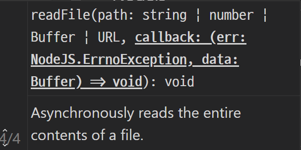

# index
1. [nodejs 구조](#nodejs-구조)
2. [동기 / 비동기](#동기-/-비동기)
3. [Promise](#promise)
4. [async / await](#async-/-await)

# Nodejs

## Nodejs란

Nodejs는 자바스크립트 런타임입니다.
즉 javascript가 실행할 수 있는 환경을 의미합니다.

> Q. nodejs와 express
> nodejs는 자바스크립트가 실행할 수 있는 환경, 런타임이며
> express는 자바스크립트로 이루어진 프레임워크입니다.

[출처](https://velog.io/@honeysuckle/책-리뷰-Node.js-교과서-1장-노드-시작하기)


## Nodejs 특징

1. Non-Blocking I/O
2. Single Thread
3. 이벤트 기반

### Non-Blocking I/O vs Blocking I/O



**동기(Blocking, Sync)** 방식은 요청을 하고 완료를 할 때 까지 기다리는 방식이다. 완료 메세지가 올 때까지 Idle 상태가 되며 대기한다.

반면 **비동기(Non-Blocking, Async)** 방식은 요청을 하고 바로 제어권을 돌려 받는다. 즉 요청만 하고 다시 프로그램을 처리하다가 완료 이벤트가 발생하면 미리 지정한 처리를 진행한다.

Nodejs는 **비동기(Non-Blocking, Async)** 으로 동작한다. 


[참고자료](https://medium.com/@qhdrbs1341/well-node-js-1-34268bc6951a)

### Single Thread

#### Thread Pool 방식
 

[이미지 출처](https://strongloop.github.io/strongloop.com/strongblog/node-js-is-faster-than-java/)

기존의 서버 Design은 Thread Pool 방식이다.
Client로 부터 요청이 오면 Thread Pool에서 하나를 할당해준다. 각 Thread별로 요청이 들어왔는지 확인해야 하므로 매번 context-switching를 진행해야 하며 이는 많은 비용을 요구한다.

#### Single Thread


[이미지 출처](https://strongloop.github.io/strongloop.com/strongblog/node-js-is-faster-than-java/)

Nodejs는 single thread로 동작하지만 event-driven를 통해서 동시성(Concurrency)를 확보합니다.

> 동시성 vs 병렬성
> 
> ***동시성*** 은 흐름을 실행시키는 것은 **하나**이지만 time-slicing, time-quantum등으로 작은 단위로 나누어서 흐름을 돌아가면서 동시에 일어나는 것처럼 만들어 주는 방식이며 ***병렬성*** 은 실제 흐름을 실행시키는 것이 **복수개** 인 것을 의미합니다.

> nodejs의 multi thread
>
> Nodejs에는 I/O 처리를 위한 libuv 라이브러리가 있다. 이는 I/O 요청이 발생할 때마다 커널에서 비동기를 지원하는 경우에는 해당 함수를 직접 호출한다. 하지만 이를 지원하지 않는 경우에는 blocking방식으로 수행하는 worker-thread를 만든다.

### 이벤트 기반(event-driven)

Nodejs는 이벤트 기반으로 동작한다. 이벤트 기반은 이벤트가 발생 할 때 미리 지정해 놓은 작업을 수행하는 방식이다.
노드는 이벤트에 Callback 함수를 지정해서 동작한다.

참고: [Reactor 패턴](https://subscription.packtpub.com/book/web_development/9781783287314/1/ch01lvl1sec09/the-reactor-pattern)

## Nodejs 구조


V8: 이는 구글에서 Chrome 브라우저 용으로 개발한 자바스크립트 엔진입니다. V8은 혁신적인 설계와 속도, 그리고 효율적인 메모리 관리로 높은 평가를 받고 있습니다.
libuv: C언어로 만들어져서 낮은 수준의 기능들을 javascript에 래핑하고 사용하도록 해주는 바인딩 세트입니다.
Code Javascript: Nodejs API을 구현하고 있습니다.

## 자바스크립트 심화

Javascript의 대부분은 Single Thread를 쓰며 Call back Queue를 사용한다.

### 자바스크립트 엔진


[이미지 출처](https://blog.sessionstack.com/how-does-javascript-actually-work-part-1-b0bacc073cf)

JavaScript는 크게 Memory Heap과 Call Stack으로 구성된다.

Memory Heap: 메모리 할당되는 곳
Call Stack: 호출 스택이 쌓이는 곳

### Runtime


Javascript에는 Browser, node등의 다양한 런타임이 존재합니다. 자바스크립트 엔진 외에도 자바스크립트에 관여하는 다양한 요소들이 있습니다. 그중에서 DOM, AJAX, Timeout과 같이 브라우저에서 제공하는 API들을 Web API라고 합니다.

아래 보면 event loop와 Callback Queue도 존재합니다.

### Callback Stack

javascript에서는 Call Stack을 이용해서 현재 프로그램의 위치를 추적합니다.

아래 예시를 보겠습니다.
```
function multiply(x, y) {
    return x * y;
}
function printSquare(x) {
    var s = multiply(x, x);
    console.log(s);
}
printSquare(5);
```
위 코드를 실행하면 call stack은 아래와 같이 동작합니다.


[출처](https://blog.sessionstack.com/how-does-javascript-actually-work-part-1-b0bacc073cf)

----
이제부터는 실습을 진행하겠습니다.

# ES6 문법

## var, let, const
```
var: function scope
let, const: block scope
```
var는 function scope이며 블록이 아닌 함수에 속한 변수이다. 만약 함수 중간에 선언되더라도 호이스팅에 의해서 함수 가장 윗부분에 선언되는 결과를 갖는다.
반면 let과 const는 블록 스코프를 가진다.

```
var, let: mutable
const: immutable
```
var와 let은 변경이 가능한 변수이며 const는 변경이 불가능하다.
이때 const로 객체를 만드는 경우 객체의 내용은 변경할 수있으며 참조만 변경이 불가능하다.

## 화살표 함수

ES6에서는 화살표 함수를 지원한다.
기존의 function보다 빠르며 간결한 구문을 보여주는 함수이다.
항상 익명함수이다.

```
// 기존의 function
var plus = function(a, b) { 
    return a + b; 
}
```

```
// array function
let plus = (a, b) => {
    return a + b; 
}
```

array function의 또다른 특징은 lexical scope입니다.
기존의 function의 this는 전역개체를 의미했습니다.
```
function OriginFunction() {
    this.age = 10;
    console.log(this);

    function growUp() {
        this.age ++;
        console.log(this.age);
    };
    growUp();
}
new OriginFunction();
```
위 코드를 실행하면 아래 결과가 나옵니다.
```
OriginFunction { age: 10 }
NaN
```
결과를 보면 growUp에서 this는 NaN으로 출력된다. this를 출력해보면 OriginFunction객체가 아닌 전역개체로 바인딩 되어있기 때문이다.

```
function PersonArrowFunction() {
    this.age = 10;
    console.log(this);
    var growUp= () => {
        this.age ++;
        console.log(this.age);
    };
    growUp();
}
new PersonArrowFunction();
```
```
PersonArrowFunction { age: 10 }
11
```
function은 전역객체를 바인딩하는 반면에 arrow function는 현재 블록의 this를 바인딩합니다. growUp함수가 존재하는 위치의 this는 PersonArrowFunction객체이므로 age가 10에서 11로 증가 된것을 확인 할 수 있습니다.

# 동기 / 비동기

## 비동기란

```
 function task1(){
    setTimeout(function(){
        console.log('task1');
    }, 0);
}    
function task2(){
    console.log('task2');
}
function task3(){
    console.log('task3');
}   
task1();
task2();
task3();
```

위 코드에서 task1은 0초 후에 진행시켰기 때문에  task 1,2,3순으로 출력될 거 같지만, 결과는 다르게 나옵니다. 이는 task1은 비동기로 처리되었기 때문입니다.

[소스 코드 출처](https://seongdohee.github.io/2018/05/02/promiss-pattern1.html)

----

## Sync/Async P1: fs

> 파일 읽기/쓰기 에는 Sync/Async 두가지 모드가 존재한다. 이를 직접 실습해보면서 차이를 학습한다.

### 동기 파일 쓰기 (fileWriteSync)

[practice-sync-file-write.js](./sourcecode/practice-sync-file-write.js)
```
const fs = require('fs');

const data = 'reserved message for the file';

const fileList = ['syncText.txt', 'asyncText.txt']

fileList.forEach((fileName) => {
    console.log(`file[${fileName}] read ready`);
    let result = fs.readFileSync(fileName);    
    console.log(`file[${fileName}] read complete with '${result}'`);
})
```
```
file[syncText1] write complete
file[syncText2] write complete
file[syncText3] write complete
file[syncText4] write complete
file[syncText5] write complete
```
위 결과가 나온다. 이는 순차적으로 파일이 쓰여진 것을 알 수 있다.


### 비동기 파일 쓰기 (fileWriteAsync)

[practice-async-file-write.js](./sourcecode/practice-async-file-write.js)

```
const fs = require('fs');

const numArr = [1, 2, 3, 4, 5];
const fileCommonName = 'asyncText';

numArr.forEach((num) => {
    const fileName = fileCommonName+num;
    const data = `reserved message for the '${fileName}'`;
    fs.writeFile(`${fileName}.txt`, data, ()=>{
        console.log(`file[${fileName}] write complete`);
    });
});
```
```
file[asyncText3] write complete
file[asyncText4] write complete
file[asyncText2] write complete
file[asyncText1] write complete
file[asyncText5] write complete
```
이번에는 실행할 때 마다 순서가 다는것을 알 수 있다. 이는 비동기적으로 처리하기 때문이다.

--- 

아직 이해가 안될 수 있기 때문에 이번에는 파일을 읽는 실습을 진행해보겠습니다.


### 동기 파일 읽기 (fileReadSync)


[practice-sync-file-read.js](./sourcecode/practice-sync-file-read.js)
```
const fs = require('fs');

const numArr = [1, 2, 3, 4, 5];
const fileCommonName = 'syncText';

numArr.forEach((num) => {
    const fileName = fileCommonName+num;
    const data = fs.readFileSync(`${fileName}.txt`);
    console.log(`file[${fileName}] with ${data}`);
})
```
```
file[syncText1] with reserved message for the 'syncText1'
file[syncText2] with reserved message for the 'syncText2'
file[syncText3] with reserved message for the 'syncText3'
file[syncText4] with reserved message for the 'syncText4'
file[syncText5] with reserved message for the 'syncText5'
```
다시한번 동기 방식으로 순차적으로 출력된 것을 확인할 수 있습니다.

### 비동기 파일 읽기 (fileReadAsync)

[practice-async-file-read.js](./sourcecode/practice-async-file-read.js)

```
const fs = require('fs');

const numArr = [1, 2, 3, 4, 5];
const fileCommonName = 'asyncText';

numArr.forEach((num) => {
    const fileName = fileCommonName+num;
    fs.readFile(`${fileName}.txt`, (err, data) => {
        console.log(`file[${fileName}] with ${data}`);
    });
});
```
```
file[syncText1] with reserved message for the 'syncText1'
file[syncText2] with reserved message for the 'syncText2'
file[syncText3] with reserved message for the 'syncText3'
file[syncText4] with reserved message for the 'syncText4'
file[syncText5] with reserved message for the 'syncText5'
```
여기서 잠시 주목할 점이 있다면
```
(err, data) => {
```
위 부분이다. 파일을 읽어온 후에 호출되는 callback함수는 아래와 같은 형태이다.


콜백 함수의 첫번째 인자는 error 관련 정보고, 2번째 인자는 data가 담아져서 호출된다는 것을 알 수 있다.

# Callback Hell

## pbkdf2 모듈

PBKDF2(Password-Based Key Derivation Function)는 가장 많이 사용되는 key derivation function이다. 해시 함수의 컨테이너인 PBKDF2는 솔트를 적용한 후 해시 함수의 반복 횟수를 임의로 선택할 수 있다. PBKDF2는 아주 가볍고 구현하기 쉬우며, SHA와 같이 검증된 해시 함수만을 사용한다.

```
DIGEST = PBKDF2(PRF, Password, Salt, c, DLen)  
```
PRF: 난수(예: HMAC)<br/>
Password: 패스워드<br/>
Salt: 암호학 솔트<br/>
c: 원하는 iteration 반복 수<br/>
DLen: 원하는 다이제스트 길이<br/>

--- 

PDFKDF2 함수를 이용해서 password를 암호화 하고 file에 쓰는 작업을 아래와 같이 비동기로 처리 할 수 있습니다.

```
const crypto = require('crypto');
const pbkdf2 = require('pbkdf2');
const fs = require('fs');

const password = 'password';
crypto.randomBytes(32, (err, salt) => {
    if(err) throw err;
    pbkdf2.pbkdf2(password, salt, 1, 32, 'sha512', (err, derivedKey) => {
        if(err) throw err;
        fs.writeFile('password.txt', derivedKey.toString('hex'), (err) => {
            if(err) throw err;
            console.log('complete write password');
        })
    })
})
```

하지만 코드를 보면 callback함수 안에 callback함수 안에 callback 함수안에 결과를 출력하는 로직이 들어 있습니다.
이처럼 여러개의 콜백함수가 중첩되어 코드를 읽기 어려워지는 것을 콜백헬 이라고 부릅니다.

비동기 처리에는 다양한 장점이 있지만 이 Callback hell이 발생하는 문제점이 있습니다.
이를 해결하는 방법에 대해서 알아보겠씁니다.


> 모듈 자체에서 지원하는 동기 방식으로 구현하면 아래와 같이 만들 수 있습니다.
```
const crypto = require('crypto');
const pbkdf2 = require('pbkdf2');
const fs = require('fs');

const password = 'password';
const salt = crypto.randomBytes(32);
const derivedKey = pbkdf2.pbkdf2Sync(password, salt, 1, 32, 'sha512');
fs.writeFileSync('password.txt', derivedKey.toString('hex'));
console.log('complete write password');
```

## Callback Hell 제거

Callback Hell을 제거하기 위한 방법으로 3가지를 소개합니다.

1. Keep your code shallow

> 코드를 최대한 얕게 유지해라.

```
const crypto = require('crypto');
const pbkdf2 = require('pbkdf2');
const fs = require('fs');

const password = 'password';
crypto.randomBytes(32, (err, salt) => {
    if(err) throw err;
    pbkdf2.pbkdf2(password, salt, 1, 32, 'sha512', (err, derivedKey) => {
        if(err) throw err;
        fs.writeFile('password.txt', derivedKey.toString('hex'), (err) => {
            if(err) throw err;
            console.log('complete write password');
        })
    })
})
```
위 코드에서 익명함수에 이름을 붙여주고 분리시킨다면 아래와 같은 코드 구조를 얻을 수 있다.

```
const crypto = require('crypto');
const pbkdf2 = require('pbkdf2');
const fs = require('fs');

const password = 'password1234';
crypto.randomBytes(32, madeSaltFunc);
function madeSaltFunc(err, salt) {
    if(err) throw err;
    pbkdf2.pbkdf2(password, salt, 1, 32, 'sha512', madeKeyFunc);
}
function madeKeyFunc(err, derivedKey) {
    if(err) throw err;
    fs.writeFile('password.txt', derivedKey.toString('hex'), wroteFileFunc);
}
function wroteFileFunc(err) {
    if(err) throw err;
    console.log('complete write password');
}
```

이는 ```{}```의 중첩을 최소화 한 것을 확인 할 수 있다.

2. Modularize

하나의 기능을 하는 작은 모듈을 만들고 이를 조립하여 큰 모듈을 만든다면 콜백헬을 감소시킬 수 있습니다.

위에 나온 코드는 암호화 하는 로직과 파일을 쓰는 로직 두가지 책임을 가지고 있습니다. 따라서 암호화 관련 로직만 encryption.js로 분리해 보겠습니다.

[encryption.js](./encryption.js)
```
const crypto = require('crypto');
const pbkdf2 = require('pbkdf2');

function encryptPBKDF2(password, next){
    crypto.randomBytes(32, madeSaltFunc);
    function madeSaltFunc(err, salt) {
        if(err) throw err;
        pbkdf2.pbkdf2(password, salt, 1, 32, 'sha512', madeKeyFunc);
    }
    function madeKeyFunc(err, derivedKey) {
        if(err) throw err;
        next(err, derivedKey.toString('hex'));
    }
}

module.exports = encryptPBKDF2;
```

[practice-module-pbkdf2-fix2](./practice-module-pbkdf2-fix2)
```
const fs = require('fs');
const encryption = require('./encryption');

const password = 'password1234';
encryption(password, (error, derivedKey) => {
    fs.writeFile('password2.txt', derivedKey, wroteFileFunc);
    function wroteFileFunc(err) {
        if(err) throw err;
        console.log('complete write password');
    }
})
```

이렇게 모듈화를 시킨다면 콜백 헬을 최소화 할 수 있습니다.

3. Handle every single error

에러에는 다양한 종류에 에러가 있습니다.
syntax-error: 문법 오류
runtime-error: 실행 중 발생하는 오류
platform-error: 외부에 의한 오류

1,2 번은 readable에 관련된 rule이였다면 3번은 stable에 관련된 규칙입니다.

비동기 패턴을 사용하면 중간에 에러가 발생하는 경우 특별한 처리를 하지 않는다면 다른 그 에러에 대해서 절때 알 수 없는 경우가 발생합니다.

따라서 가장 유명한 방법은 콜백 함수의 첫 번째 인자를 error 관련 값으로 지정하는 것입니다.

지금까지 실습 코드를 확인해보면 콜백함수에 ```(err, ...) => {}```으로 시작하는 것을 확인 할 수 있습니다.

이렇게 하는 이유는 만약 err가 첫번째 인자가 아니라면
```
function handleFile (file) {
    // ...
 }
```
이와 같은 코드를 작성할 때 에러에 대한 처리를 생량하고 코드를 짜게 됩니다.

Javascript Standard Style에도 이와 같은 에러 관련 규칙이 명시 되어있습니다.

eslint: handle-callback-err
```
// ✓ ok
run(function (err) {
  if (err) throw err
  window.alert('done')
})
```
```
// ✗ avoid
run(function (err) {
  window.alert('done')
})
```

[Javascript Standard Style 규칙 더 보기](https://standardjs.com/rules.html)

[출처](http://callbackhell.com/)

[출처 (한글)](https://medium.com/@pitzcarraldo/callback-hell-%EA%B3%BC-promise-pattern-471976ffd139)

----

이 이외에도 Callback Hell을 해결하기 위한 Promise, async 모듈, ES6의 async/await등이 있습니다. 

# Promise

다음은 Callback 헬을 해결하기 위한 방법중에서 Promise 패턴에 대해서 소개하겠습니다.

## Promise 패턴

프로미스는 비동기 처리에 사용되는 객체입니다.
프로미스 객체가 생성되는 순간에는 알 수 없는 값을 처리하기 위해서 만드는 대리자입니다.
값을 바로 반환하는 대신에 Promise 객체를 반환해서 **비동기 메소드를 동기 메소드처럼** 만들어 줄 수 있습니다.

Promise에는 3가지 상태가 존재합니다.

pending: 최초 생성된 시점의 상태<br/>
fulfilled: 작업이 성공적으로 완료 된 상태<br/>
rejected: 작업이 실패한 상태<br/>

Promise객체는 아래와 같이 만들 수 있습니다.

```
function readFile(filename, enc){
  return new Promise(function (fulfill, reject){
    fs.readFile(filename, enc, function (err, res){
      if (err) reject(err);
      else fulfill(res);
    });
  });
}
```

## Promise Syntax
```
new Promise(executor);
```
executor: resolve와 reject를 파라미터로 갖는 함수 입니다. resolve는 작업이 성공했을때, reject는 실패했을 때 실행되는 callback함수입니다.


## Promise 흐릉


[이미지 출처](https://joshua1988.github.io/web-development/javascript/promise-for-beginners/)

resolve 함수를 호출하면 fulfilled 상태과 되며
reject 함수를 호출하면 rejected 상태가 됩니다.
fulfilled 상태는 then을 통해서 전달되며
rejected는 catch를 통해서 전달 됩니다.

### fulfiled

```
function getData() {
  return new Promise(function (resolve, reject) {
    var data = 25;
    resolve(data);
  });
}

getData().then(function (resolvedData) {
  console.log(resolvedData);
});
```
```
25
```

### rejected

```
function getData() {
  return new Promise(function (resolve, reject) {
    reject(new Error("Request is failed"));
  });
}

getData().then().catch(function (err) {
  console.log(err);
});
```
```
Error: Request is failed
```

##  Promise Chaining

### Practice-1

첫 번째 예제는 
1) score배열 생성
2) 배열의 합 구하기
3) 점수를 등급으로 변환하기
이 3가지 작업을 promise chaining으로 구현하겠습니다.

```
function getScoreArray(size) {
    return new Promise(function (resolve, reject) {    
        if(size <= 0){
            reject(new Error("size must be positive"));
            return;
        }
        const arr = [...Array(size)].map(idx => parseInt(Math.random()*11));
        console.log(`array is ${arr}`);
        resolve(arr);
    });
}
```
첫번째 함수(getScoreArray)는 size개만큼 랜덤한 숫자를 생성하는 함수입니다.
만약 size가 0과 같거나 작으면 reject로 에러는 전달합니다.


```
function getSum(arr) {
    return new Promise(function (resolve, reject) {
        const sum = arr.reduce((prev, current) =>  prev + current);
        if(sum <= 0){
            reject(new Error("sum must be larger than 0"));
            return;
        } 
        console.log(`sum: ${sum}`);
        resolve(sum);
    });
}
```
두번째 함수(getSum)는 배열을 인자로 받아서 요소의 합을 구합니다.
이때 [reduce 함수](https://developer.mozilla.org/ko/docs/Web/JavaScript/Reference/Global_Objects/Array/Reduce)를 이용했습니다.
이때 합의 결과가 0보다 작은 경우는(위 예제에서 발생하지 않습니다.) 에러를 발생시킵니다.
이때 주의해야 할 점이 있는데, reject함수를 호출한 이후에 return을 하지 않는다면 reject와 resolve 모두 호출되는 결과를 얻어 문제의 소지가 생깁니다.

```
function getGrade(result) {
    return new Promise(function (resolve, reject) {    
        let grade;
        switch(parseInt(result / 10)){
            case 9:
            case 8:
                grade = 'A';
                break;
            case 7:
                grade = 'B';
                break;
            case 6:
                grade = 'C';
                break;
            case 5:
                grade = 'D';
                break;
            default:
                reject(new Error(`too low score(${result})`));
                return;
        }
        resolve(grade);
    });
}
```
3번째 함수는 getGrade입니다. 점수를 입력받으면 등급을 반환해주는 함수입니다.
이때 50점 미만인 경우에는 에러를 발생시키도록 구현했습니다.

이제 이 3가지 Promise함수를 체이닝을 하겠습니다.
```
getScoreArray(10)
.then(getSum)
.then(getGrade)
.then((result) => console.log(`grade is ${result}`))
.catch(err => {
    console.log(`Error: ${err}`);
})
```
각각의 Promise가 then을 통해서 결과가 전달되며 중간에 에러가 발생하면 이후의 then으로 전달되지 않으며 catch으로 이동하게 됩니다.

catch가 무조건 then위에 와야 하는 것은 아닙니다.
```
getScoreArray(-1)
.catch(err => {
    console.log(`Error: ${err}`);
    return [...Array(5)].fill(10);
})
.then(getSum)
.then(getGrade)
.then((result) => console.log(`grade is ${result}`))
.catch(err => {
    console.log(`Error3: ${err}`);
})
```
then과 catch를 이용해서 getScoreArray에서 에러가 발생한 경우에는 Dummy Array를 입력으로 넣도록 구현할 수 도 있습니다.

### Practice-1

두 번째 예제는 json2csv와 csvtojson모듈을 이용해서 csvManager를 Promise 패턴으로 구현해보겠습니다.

그전에 앞서서 module에 대한 소개를 먼저하겠습니다.

#### json2csv

json2csv 모듈은 JSON 형태의 Javascript 객체를 CSV형태의 String으로 변환해줍니다.
[json2csv](https://www.npmjs.com/package/json2csv)

> csv란 
> 
> Excel과 DB와 호환되는 텍스트 형식입니다.
> 첫번째 줄에는 필드 이름이 들어가며 2번째 줄부터 각 ROW에 해당하는 값이 들어 있습니다.

```
const json2csv = require('json2csv');

const jsonArray = [{id:'admin', pw: 'admin', name:'관리자'},
                    {id:'heesung', pw: '1q2w3e4r!', name:'윤희성'},
                    ,{id:'starbucks', pw: 'JamongBlackHoneyTea', name:'스타벅스'}];

const resultCsv = json2csv.parse(jsonArray)
console.log(resultCsv)
```
```
"id","pw","name"
"admin","admin","관리자"
"heesung","1q2w3e4r!","윤희성"
"starbucks","JamongBlackHoneyTea","스타벅스"
```


#### csvtojson

csvtojson 모듈은 csv 포맷에서 JSON으로 가져오는 모듈입니다.
[csvtojson](https://www.npmjs.com/package/csvtojson)

실습을 위해서 csv파일을 생성합니다.
> csvtojson.csv
```
"id","pw","name"
"admin","admin","관리자"
"heesung","1q2w3e4r!","윤희성"
"starbucks","JamongBlackHoneyTea","스타벅스"
```

```
const csv = require('csvtojson');

csv().fromFile('./csvtojson.csv').then((jsonArr) => {
    if (!jsonArr) {
        console.log(`file read err: ${err}`);
        return;
    }
    console.log(jsonArr);
}, (err) => {
    console.log(`err with readCSV: ${err}`);
})
```
파일이 존재하는 경우
```
[ { id: 'admin', pw: 'admin', name: '관리자' },
  { id: 'heesung', pw: '1q2w3e4r!', name: '윤희성' },
  { id: 'starbucks', pw: 'JamongBlackHoneyTea', name: '스타벅스' } ]
```
파일이 존재하지 않는경우
```
err with readCSV: Error: File does not exist. Check to make sure the file path to your csv is correct.
```
위 결과를 얻을 수 있습니다.
csvtojson에서는 동기처리가 아닌 비동기 처리 인것을 알 수있으며 Promise와 같이 then으로 체이닝 된 것을 볼 수 있습니다.

> ES2015에서 제공하는 Promise이외에도 다양한 외부 라이브러리가 존재합니다.
[Bluebird](https://npmjs.org/package/bluebird)
[Q](https://npmjs.org/package/q)
[RSVP](https://npmjs.org/package/rsvp)
[Vow](https://npmjs.org/package/vow)
[When.js](https://npmsjs.org/package/when)
이러한 Promise 패턴을 제공하는 라이브러리는 [Promise/A+](https://promisesaplus.com/)표준 규격을 따릅니다. csvtojson 모듈을 확인하면 bluebird library로 구현된것을 확인할 수 있습니다.

#### csvManager만들기

이제 부터는 csvManager 모듈을 만들겠습니다.<br/>
csvManager는 크게 2가지 기능을 가지고 있습니다.

1. json data를 csv파일로 저장
2. csv파일을 읽어서 json data로 반환

[csvManager1.js](./project/modules/csvManager1.js)
[csvManager1Test.js](./project/modules/csvManager1.test.js)
[csvManager2.js](./project/modules/csvManager2.js)
[csvManager2Test.js](./project/modules/csvManager2.test.js)

# async / await

