# 5차 세미나

# index
1. [multer](#multer)
2. [multer with s3](#multer-with-s3)
3. [jwt](#jwt)

# multer

Multer는 파일 업로드를 위해 사용되는 multipart/form-data 를 다루기 위한 node.js 의 미들웨어 입니다. 

[출처](https://github.com/expressjs/multer/blob/master/doc/README-ko.md)

## 개요
database의 경우에는 파일을 저장할 수 있는 방법이 없습니다. 따라서 서버 혹은 외부 저장소에 저장을 시키고 URL을 DB에 저장을 시켜야 합니다.
이때 사용하는 방법중에 하나가 multer를 이용하는 방법입니다.
multer는 파일을 업로드하면 내부/외부 저장소에 저장을 하고 File객체를 request 객체에 추가합니다.


## 설치 
```
$ npm install --save multer
```


## 예시 코드
```
const express = require('express')
const router = express.Router();

const multer = require('multer');
const upload = multer({
    dest: 'uploads/'
});

router.post('/single', upload.single('image'), (req, res) => {
    // req.file 은 `image` 라는 필드의 파일 정보입니다.
    // 텍스트 필드가 있는 경우, req.body가 이를 포함할 것입니다.
    console.log(req.file);
    console.log(req.body);
    res.send({
        file: req.file,
        body: req.body
    });
})

router.post('/array', upload.array('photos', 4), (req, res) => {
    // req.files 는 `photos` 라는 파일정보를 배열로 가지고 있습니다.
    // 이때 두 번째 파라미터인 4는 최대 이미지의 개수(maxCount)입니다.
    // 텍스트 필드가 있는 경우, req.body가 이를 포함할 것입니다.
    console.log(req.files);
    console.log(req.body);
    res.send({
        file: req.files,
        body: req.body
    });
})

var cpUpload = upload.fields([{
    name: 'thumbnail',
    maxCount: 1
}, {
    name: 'images',
    maxCount: 8
}])

router.post('/fields', cpUpload, (req, res) => {
    // req.files는 (String -> Array) 형태의 객체 입니다.
    // 필드명은 객체의 key에, 파일 정보는 배열로 value에 저장됩니다.
    //
    // e.g.
    //  req.files['thumbnail'][0] -> File
    //  req.files['images'] -> Array
    //
    // 텍스트 필드가 있는 경우, req.body가 이를 포함할 것입니다.
    console.log(req.files);
    console.log(req.body);
    res.send({
        file: req.files,
        body: req.body
    });
})

module.exports = router;
```

[출처](https://github.com/expressjs/multer/blob/master/doc/README-ko.md)

### localhost:3000/multerTest/single
파일을 하나 받아오는 방법입니다.
#### postman
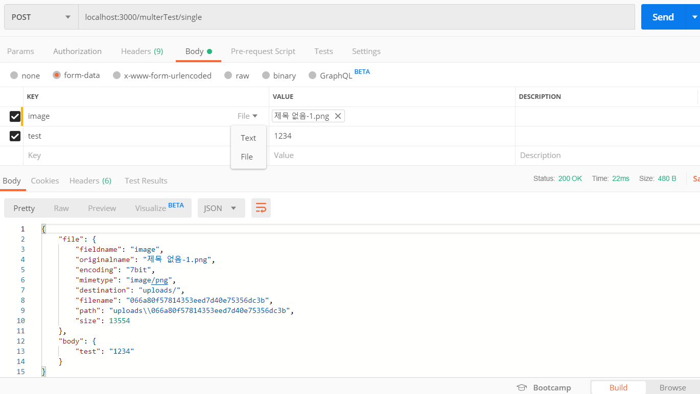

1. METHOD를 `POST`로 지정
2. url 입력
`localhost:3000/multerTest/single`
3. `Body` 선택 후 `form-data` 선택
4. key에 `image` 입력한다.
5. 이때 image 입력란에 마우스를 올리면 우측에 드롭다운 메뉴가 나타난다. File을 선택 한 이후에 values에서 파일을 선택 해준다.
6. 다음 행에 key에 `test` 입력 후 Value에 임의의 값 입력.
7. send.

위와 같은 결과가 나오면 성공입니다.

#### console
결과를 확인하면 
```
{ fieldname: 'image',
  originalname: '제목 없음-1.png',
  encoding: '7bit',
  mimetype: 'image/png',
  destination: 'uploads/',
  filename: '066a80f57814353eed7d40e75356dc3b',
  path: 'uploads\\066a80f57814353eed7d40e75356dc3b',
  size: 13554 }
[Object: null prototype] { test: '1234' }
```
위와 같은 결과가 나오는데 request의 file이라는 객체에는 file 객체에 대한 정보가 담겨져 있으며, 텍스트 필드도 body에 담겨지는 것을 확인할 수 있습니다.

### localhost:3000/multerTest/array
여러개의 파일을 받는 방법입니다.
#### postman
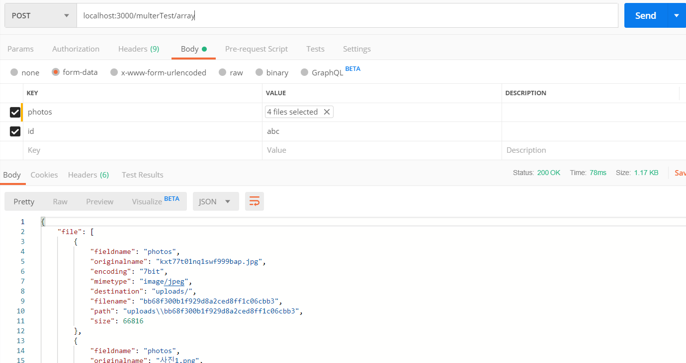

1. METHOD를 `POST`로 지정
2. url 입력
`localhost:3000/multerTest/array`
3. `Body` 선택 후 `form-data` 선택
4. key에 `photos` 입력한다.
5. 다수의 파일을 선택
6. 텍스트 필드 key, value 추가
7. send

#### console
```
[ { fieldname: 'photos',
    originalname: 'kxt77t01nq1swf999bap.jpg',
    encoding: '7bit',
    mimetype: 'image/jpeg',
    destination: 'uploads/',
    filename: 'bb68f300b1f929d8a2ced8ff1c06cbb3',
    path: 'uploads\\bb68f300b1f929d8a2ced8ff1c06cbb3',
    size: 66816 },
  { fieldname: 'photos',
    originalname: '사진1.png',
    encoding: '7bit',
    mimetype: 'image/png',
    destination: 'uploads/',
    filename: '7fad6c0bd378f3ca6b6170b034bef35f',
    path: 'uploads\\7fad6c0bd378f3ca6b6170b034bef35f',
    size: 4513 },
  { fieldname: 'photos',
    originalname: '제목 없음-1.png',
    encoding: '7bit',
    mimetype: 'image/png',
    destination: 'uploads/',
    filename: '303770457ae37401ffcbe4248da27368',
    path: 'uploads\\303770457ae37401ffcbe4248da27368',
    size: 13554 },
  { fieldname: 'photos',
    originalname: '주석 2019-09-19 112636.png',
    encoding: '7bit',
    mimetype: 'image/png',
    destination: 'uploads/',
    filename: '8b4b406cd726d73e861ae2b7420ba19a',
    path: 'uploads\\8b4b406cd726d73e861ae2b7420ba19a',
    size: 12973 } ]
[Object: null prototype] { id: 'abc' }
```
위와 같은 결과로 request.files에 file 객체 배열이 추가 된 것을 확인할 수 있으며, 텍스트 필드도 body에 담겨지는 것을 확인할 수 있습니다.
이처럼 여러개 파일을 받을 수 있습니다.

### localhost:3000/multerTest/fields
여러 파일을 다른 필드로 받는 방법입니다.
#### postman
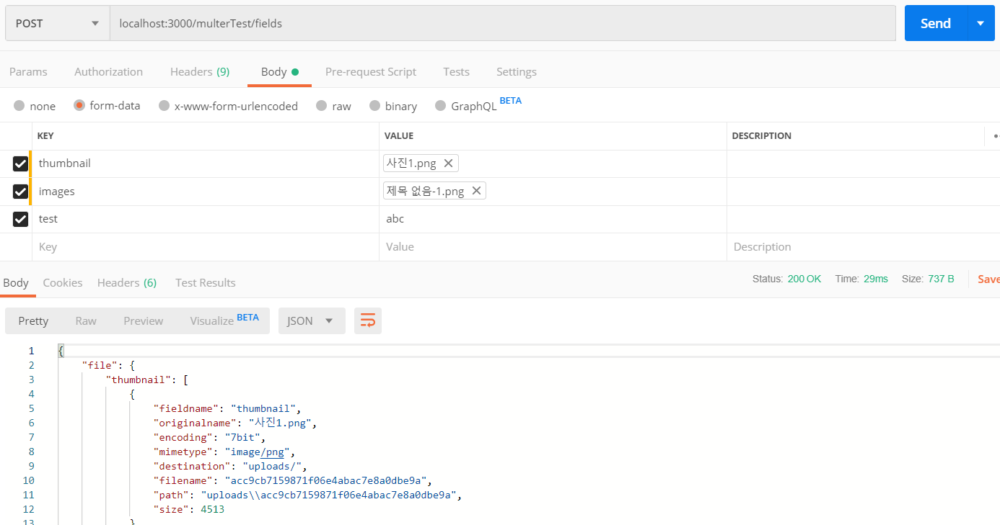

1. METHOD를 `POST`로 지정
2. url 입력
`localhost:3000/multerTest/fields`
3. `Body` 선택 후 `form-data` 선택
4. key에 `thumbnail` 입력하고 단일 파일 선택
5. key에 `images` 입력하고 단일 복수 선택
6. 텍스트 필드 key, value 추가
7. send

#### common
```
[Object: null prototype] {
  thumbnail:
   [ { fieldname: 'thumbnail',
       originalname: '사진1.png',
       encoding: '7bit',
       mimetype: 'image/png',
       destination: 'uploads/',
       filename: 'ed1b02fb7fabaff4e9024d1225f95fc3',
       path: 'uploads\\ed1b02fb7fabaff4e9024d1225f95fc3',
       size: 4513 } ],
  images:
   [ { fieldname: 'images',
       originalname: '사진1.png',
       encoding: '7bit',
       mimetype: 'image/png',
       destination: 'uploads/',
       filename: '7c61d2edd3ee3526f232c1b3ef577b26',
       path: 'uploads\\7c61d2edd3ee3526f232c1b3ef577b26',
       size: 4513 },
     { fieldname: 'images',
       originalname: '제목 없음-1.png',
       encoding: '7bit',
       mimetype: 'image/png',
       destination: 'uploads/',
       filename: '68557dfbd75ed246cbfe1904d512d00f',
       path: 'uploads\\68557dfbd75ed246cbfe1904d512d00f',
       size: 13554 },
     { fieldname: 'images',
       originalname: '주석 2019-09-19 112636.png',
       encoding: '7bit',
       mimetype: 'image/png',
       destination: 'uploads/',
       filename: '1583f3be050739b51db335b5e2323113',
       path: 'uploads\\1583f3be050739b51db335b5e2323113',
       size: 12973 } ] }
[Object: null prototype] { test: 'abc' }
```
위 결과를 통해서 multer의 fields를 이용한다면 다양한 key값을 이용해서 이미지를 받을 수 있게됩니다.

# multer with s3

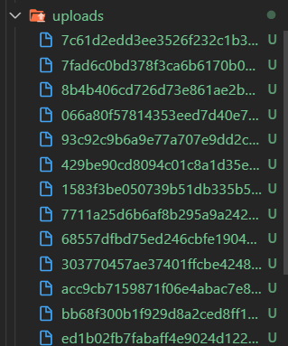

server에 파일을 저장한다면 아래와 같이 파일이 쌓이게 됩니다.
하지만 EC2와 같은 클라우드 서비스가 가지는 데이터 용량은 크지 않기 때문에 쉽게 용량을 오버할 수 있습니다.

따라서 파일을 저장하는 용도로 AWS의 S3를 많이 이용합니다.

## S3란 

Amazon Simple Storage Service는 인터넷용 스토리지 서비스입니다. 이 서비스는 개발자가 더 쉽게 웹 규모 컴퓨팅 작업을 수행할 수 있도록 설계되었습니다.

[출처](https://docs.aws.amazon.com/ko_kr/AmazonS3/latest/dev/Welcome.html)

### S3 Bucket 생성하기

1. S3 클릭 후 `버킷 만들기`

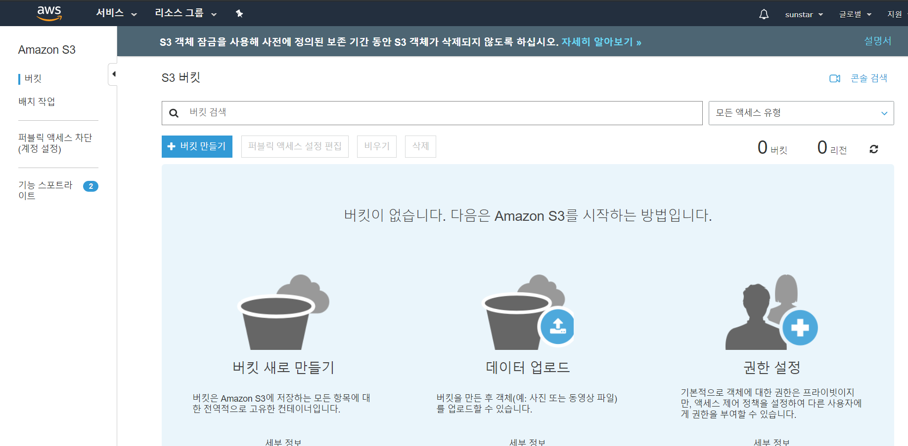

2. `버킷 이름` 지정하기

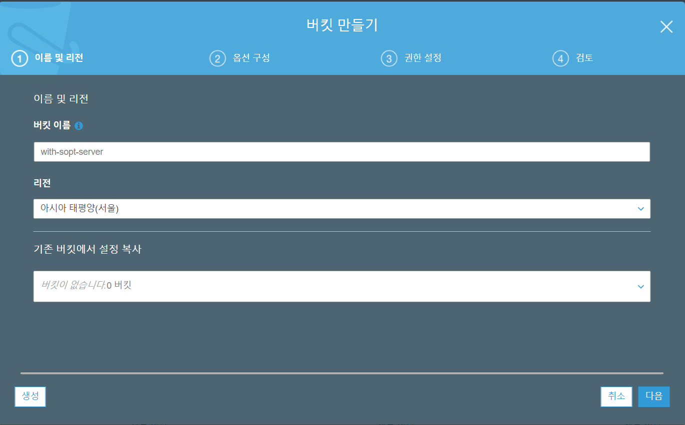

3. `다음`

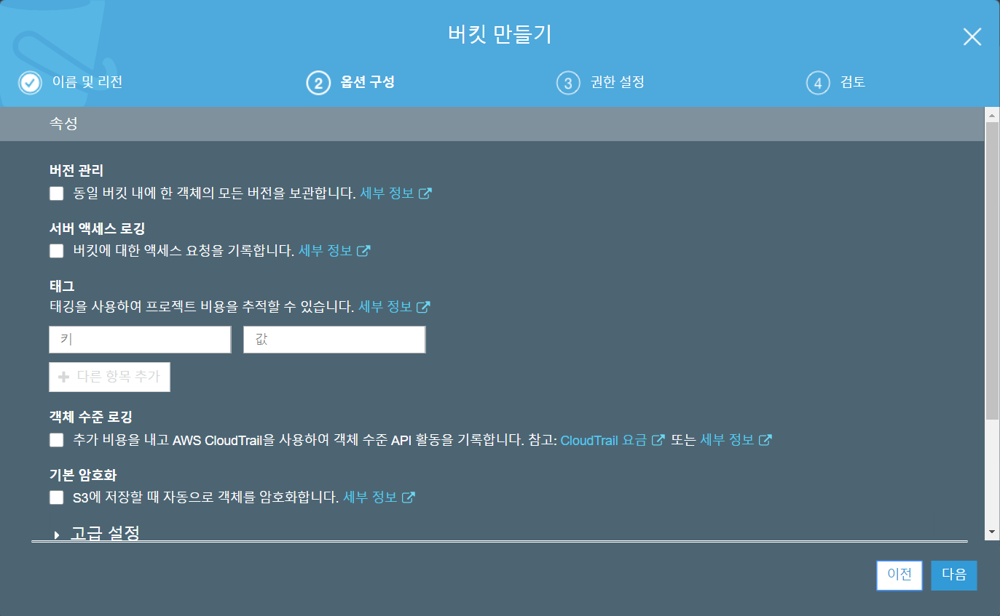

4. `모든 퍼블릭 액세스 차단` 체크 해제

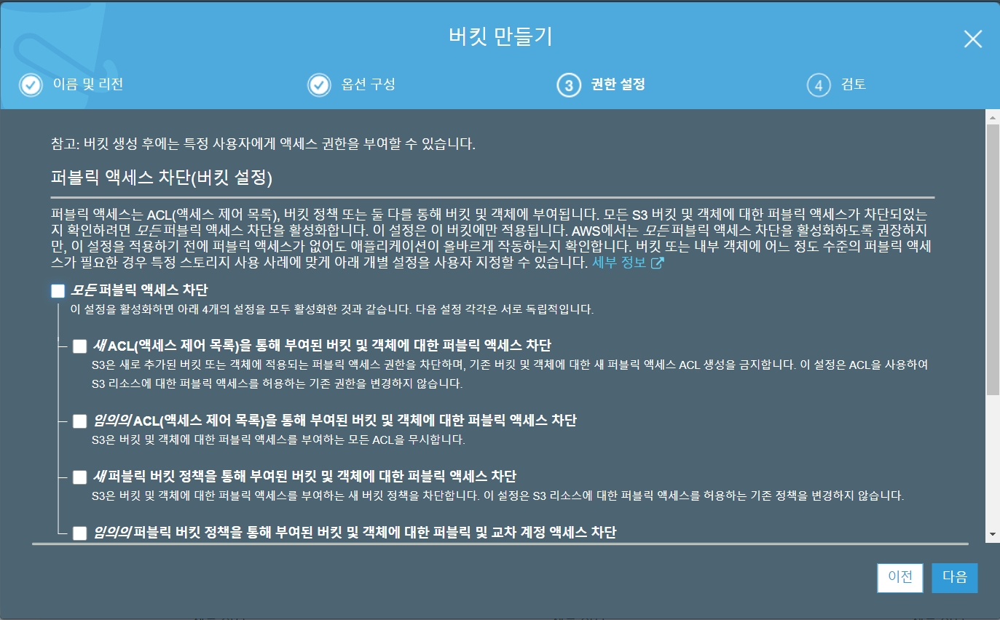

5. 버킷 생성하기

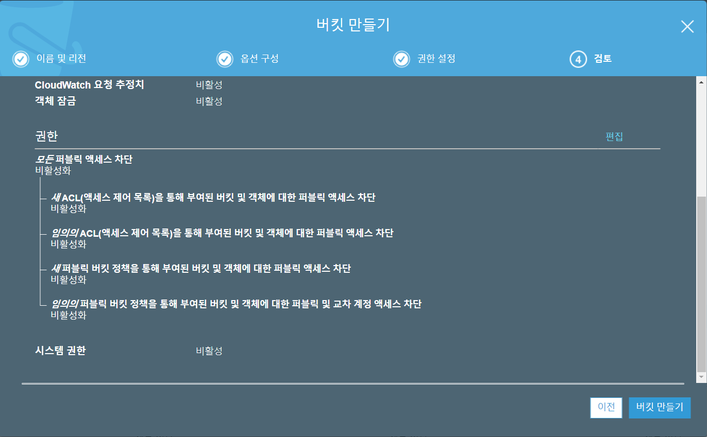

6. 생선된 버킷 클릭

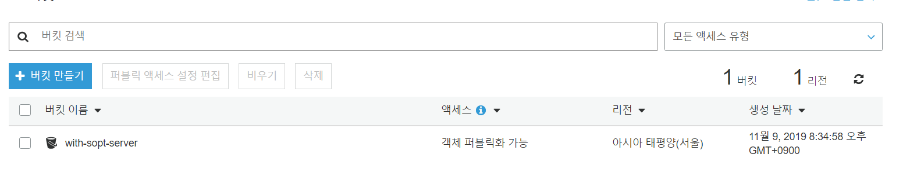

7. `권한` -> `버킷 정책` -> `정책생성기`

> 이때 `ARN`을 복사해 둔다.

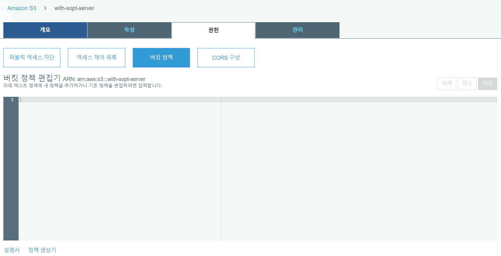

8. Type Of Policy를 `S3 Bucket Policy`로 선택한다. 또한 Principal에 `*`, AWS Service에 `Amazon S3`, Action에 `getObject`를 선택하고 ARN에 [`복사한 값`/*] 를 입력한다.

ex) arn:aws:s3:::with-sopt-server/*

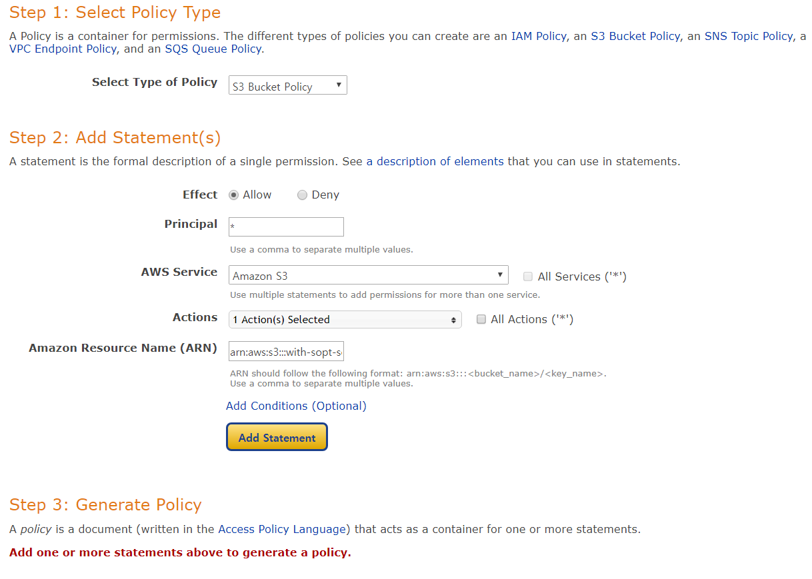

9. Add Statement를 클릭한다.

아래와 같이 ARN에 `복사한 값`과 `/*`과 모두 포함되었는지 꼭 확인한다.

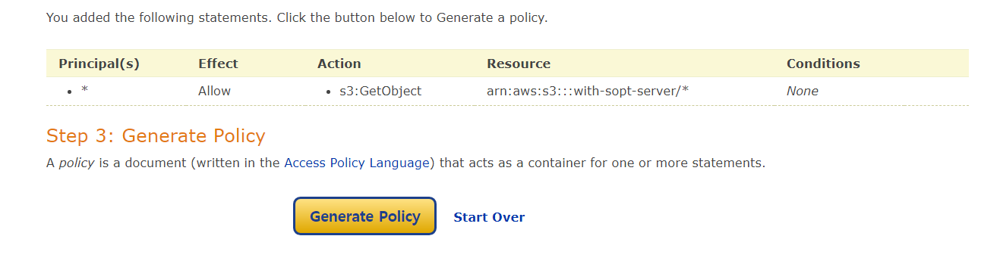

10. `get Policy`를 클릭하고 해당 내용을 복사한다.

11. 이전 화면에 복사한 내용을 아래에 붙여넣습니다.


그리고 저장을 누르면 아래와 같이 경고가 뜨면 성공입니다.

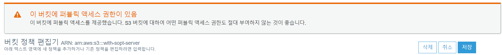

### IAM 설정하기

#### IAM 이란

AWS Identity and Access Management(IAM)는 AWS 리소스에 대한 액세스를 안전하게 제어할 수 있는 웹 서비스입니다. IAM을 사용하여 리소스를 사용하도록 인증(로그인) 및 권한 부여(권한 있음)된 대상을 제어합니다.

[출처](https://docs.aws.amazon.com/ko_kr/IAM/latest/UserGuide/introduction.html)

#### IAM 생성

1. `IAM` -> `사용자` -> `사용자 추가`
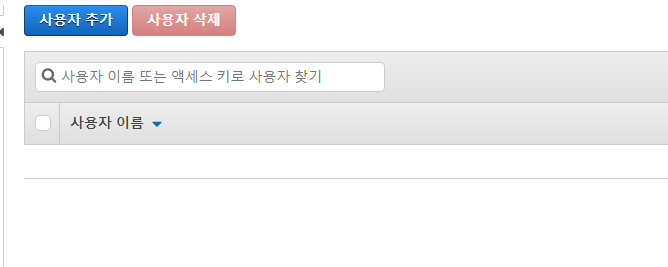

2. 사용자 이름 추가하고 `프로그래밍 방식 액세스` 체크
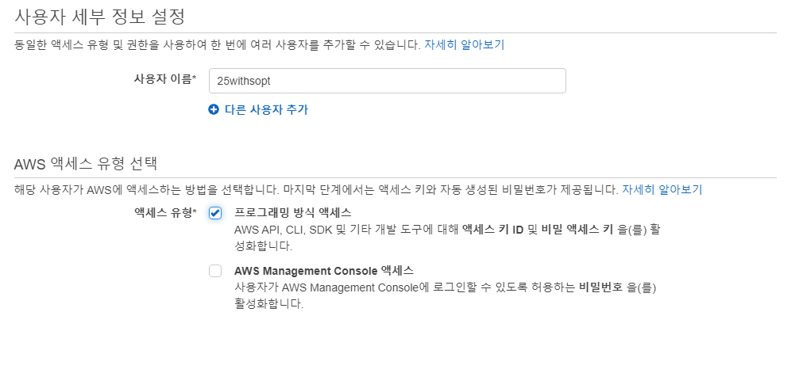

3. `기존 정책 연결` -> `AmazonS3FullAccess` 체크
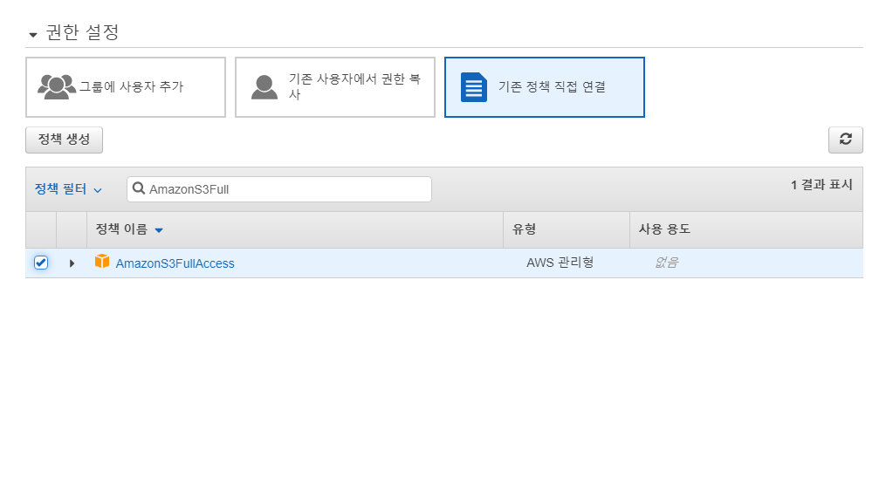

4. `다음: 태그` -> `다음: 검토` -> `사용자 만들기`

5. 아래와 같은 화면이 나옵니다.

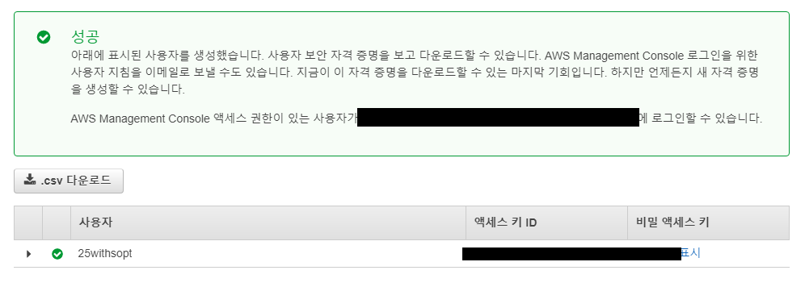

AccessKeyID와 SecretAccessKey는 해당 페이지를
나가면 볼 수 없기 때문에 <font color="red"><strong>꼭 메모</strong></font>하셔야 합니다.

또한 이 키를 git에 올리거나 <strong>분실 할</strong>경우 <font color="red"><strong>엄.청.난. 과금폭탄</strong>
</font>을 받을 수 있으니 꼭 주의하셔야 합니다.

### aws-sdk, multer-s3

#### 설치
```
npm install aws-sdk multer-s3
```

#### multer-s3 설정

1. awsconfig.json 생성

config 폴도 아래에 awsconfig.json파일을 생성하고 아래와 같이 입력한다.

```
{
    "accessKeyId": "엑세스키",
    "secretAccessKey": "시크릿키",
    "region": "ap-northeast-2"
}
```

이때 엑세스키와 시크릿키는 `IAM 생성`에서 얻은 두 키 값을 입력하면 된다.

※ 이 파일은 절때 git에 올라가면 안됩니다.

region의 경우 s3에 접속했을때 url을 확인해 보면
```
https://s3.console.aws.amazon.com/s3/buckets/with-sopt-server/?region=ap-northeast-2&tab=management
```
region을 확인할 수 있으며 해당되는 값을 입력하면 된다.


2. multer.js 생성

config폴더에 multer.js파일을 생성하고 아래의 코드를 입력한다. 또한 버킷이름을 변경해준다.
```
const multer = require('multer');
const multerS3 = require('multer-s3');
const aws = require('aws-sdk');
aws.config.loadFromPath(__dirname + '/awsconfig.json');

const s3 = new aws.S3();

const upload = multer({
    storage: multerS3({
        s3: s3,
        bucket: '버킷이름',
        acl: 'public-read',
        key: function(req, file, cb) {
            cb(null, Date.now() + '.' + file.originalname.split('.').pop());
        }
    })
});

module.exports = upload;
```

3. 사용방법

기존의 코드는 아래와 같았다.

```
const multer = require('multer');
const upload = multer({
    dest: 'uploads/'
});
```

하지만 위의 코드를 삭제하고 아래와 같이 변경하면 된다.
```
const upload = require('../config/multer');
```
> 이때 위치는 본인의 프로젝트에 맞게 경로를 설정해야 한다.

4. 적용

multer를 사용하는 것과 동일하게 사용할 수 있다.

### postman 화면
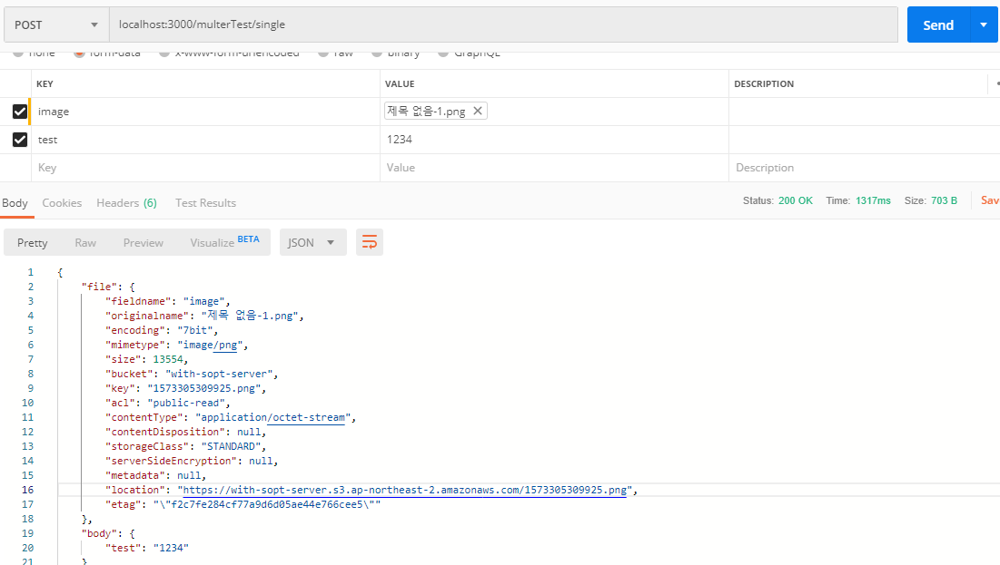
단 multer와 다르게 file객체에 좀 더 많은 정보가 담겨져 있는 것을 확인할 수 있다.
여기서 location key값에 있는 정보를 DB에 저장하면 된다.

> 또한 size와 mimetype등을 이용해서 의도하지 않는 파일 업로드에 제한을 주는 코드를 구현할 수 있다.

# jwt


## 세션 기반 인증 (참고용)

### 세션의 과정
1. 클라이언트가 로그인
2. 성공하면 서버가 유저 세션을 만들고 메모리나 데이터베이스에 저장한다.
3. 서버가 클라이언트에게 세션 ID를 보낸다.
4. 클라이언트의 브라우저에 세션의 ID만 쿠키에 저장하게 한다.

세션 데이터가 서버의 메모리에 저장되므로, 확장 시 모든 서버가 접근할 수 있도록 별도의 중앙 세션 관리 시스템이 필요하다.

### 단점

- 중앙 세션 관리 시스템이 없으면, 시스템 확장에 어려움이 생긴다.
- 중앙 세션 관리 시스템이 장애가 일어나면, 시스템 전체가 문제가 생긴다.
- 만약 메모리에 세션 정보가 들어있다면, 메모리가 많이 사용될 수 있다.
- 규모 확장이 필요없는 소규모 프로그램 작성에서는 세션 기반 인증 방식을 사용해도 상관 없을 것이다.

[출처](https://yonghyunlee.gitlab.io/node/jwt/)

## 토큰 기반 인증

토큰 기반 인증 방식을 사용에는 크게 4가지 이유가 있습니다.

### 1. stateless 서버

stateless서버의 가장 큰 특징은 서버에서 상태를 유지하지 않는 것입니다. <br/>
즉 서버는 클라이언트에서 **들어오는 요청**만으로 작업을 처리합니다. <br/>
이런 서버구조를 갖게 된다면 서버와 클라이언트의 **연관관계가 낮아**지기 때문에 **확장성**에 유리해집니다.

> ### Stateful 서버
>
> 클라이언트에게서 요청을 받을 때 마다, 클라이언트의 상태를 계속해서 유지하고, 이 정보를 서비스 제공에 이용하는 서버를 의미합니다.

### 2. 모바일 어플리케이션에 적합


### 3. 인증 정보를 다른 어플리케이션으로 전달
### 4. 보안

https://tansfil.tistory.com/58


[자세히보기](https://velopert.com/2350)

## JWT 란

## JWT 적용

[자세히보기](https://velopert.com/2389)